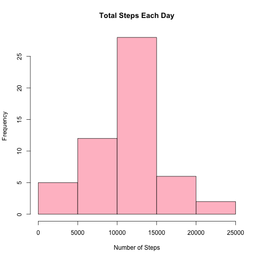
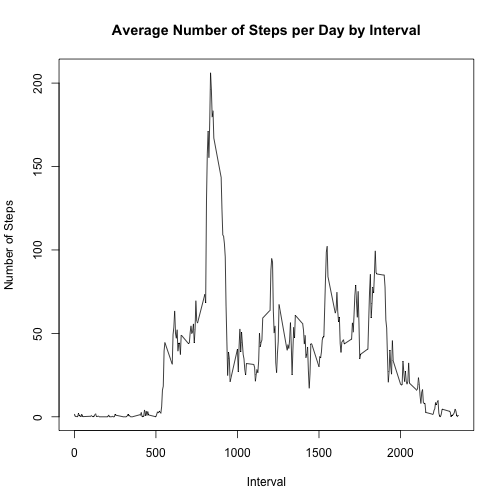
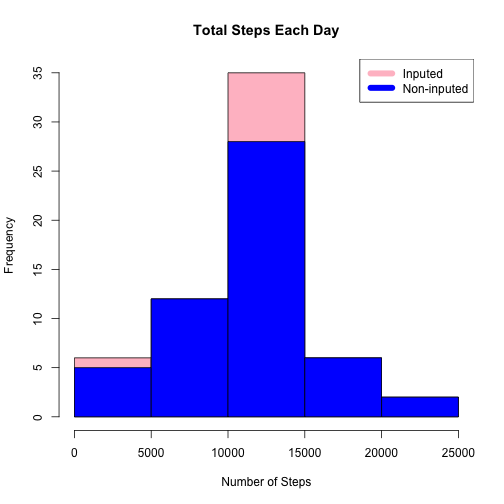
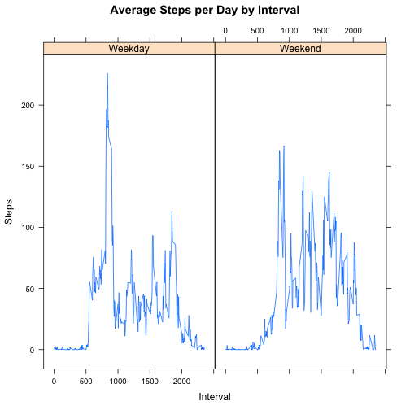

##Loading and preprocessing data
##Download, unzip and load data into data frame data


```r
library(knitr)
library(markdown)

if(!file.exists("getdata-projectfiles-UCI HAR Dataset.zip")) {
        temp <- tempfile()
        download.file("http://d396qusza40orc.cloudfront.net/repdata%2Fdata%2Factivity.zip",temp)
        unzip(temp)
        unlink(temp)
}

data <- read.csv("activity.csv")
```

###Adding total number of steps per day and creating histogram


```r
steps_by_day <- aggregate(steps ~ date, data, sum)
hist(steps_by_day$steps, main = paste("Total Steps Each Day"), col="pink", xlab="Number of Steps")
```

 

###Calculating the "mean" and "median" for the total steps per day


```r
rmean <- mean(steps_by_day$steps)
rmedian <- median(steps_by_day$steps)
```

###The mean is 1.0766189 &times; 10<sup>4</sup>.

###the median is 10765.

###What is the average daily activity pattern?

###Calculate average steps for each interval for all days.
###Plot the Average Number Steps per Day by Interval.


```r
steps_by_interval <- aggregate(steps ~ interval, data, mean)

plot(steps_by_interval$interval,steps_by_interval$steps, type="l", xlab="Interval", ylab="Number of Steps",main="Average Number of Steps per Day by Interval")
```

 

###Find interval with most average steps.


```r
max_interval <- steps_by_interval[which.max(steps_by_interval$steps),1]
```

###The 5-minute interval, on average across all the days in the data set, containing the maximum number of steps is 835.

###Input missing values. Compare data "after input missing values" to "non-input missing values".

###Missing data needed to be inputed. Missing values were inputed by inserting the average for each interval. 


```r
incomplete <- sum(!complete.cases(data))
inputed_data <- transform(data, steps = ifelse(is.na(data$steps), steps_by_interval$steps[match(data$interval, steps_by_interval$interval)], data$steps))
```

###Zeroes were inputed for 10-01-2012 because it was the first day and would have been over 9,000 steps higher than the following day, which had only 126 steps. NAs then were assumed to be zeros to fit the rising trend of the data.


```r
inputed_data[as.character(inputed_data$date) == "2012-10-01", 1] <- 0
```

###Recount total steps by day and create Histogram.


```r
steps_by_day_i <- aggregate(steps ~ date, inputed_data, sum)
hist(steps_by_day_i$steps, main = paste("Total Steps Each Day"), col="pink", xlab="Number of Steps")

#Create Histogram to show difference. 
hist(steps_by_day$steps, main = paste("Total Steps Each Day"), col="blue", xlab="Number of Steps", add=T)
legend("topright", c("Inputed", "Non-inputed"), col=c("pink", "blue"), lwd=8)
```

 


###Calculate new mean and median for inputed data.


```r
rmean.i <- mean(steps_by_day_i$steps)
rmedian.i <- median(steps_by_day_i$steps)
```

###Calculate difference between inputed (for missing value) and non-inputed data.


```r
mean_diff <- rmean.i - rmean
med_diff <- rmedian.i - rmedian
```

###Calculate total difference.


```r
total_diff <- sum(steps_by_day_i$steps) - sum(steps_by_day$steps)
```


###The inputed data mean is 1.0589694 &times; 10<sup>4</sup>.

###The inputed data median is 1.0766189 &times; 10<sup>4</sup>.

###The difference between the non-inputed mean and inputed mean is -176.4948964.

###The difference between the non-inputed mean and inputed mean is 1.1886792.

###The difference between total number of steps between inputed and non-inputed data is 7.5363321 &times; 10<sup>4</sup>. Thus, there were 7.5363321 &times; 10<sup>4</sup> more steps in the inputed data.

###Are there differences in activity patterns between weekdays and weekends?

###Create a plot to compare and contrast number of steps between the week and weekend. There is a higher peak earlier on weekdays, and more overall activity on weekends.


```r
weekdays <- c("Monday", "Tuesday", "Wednesday", "Thursday", 
              "Friday")
inputed_data$dow = as.factor(ifelse(is.element(weekdays(as.Date(inputed_data$date)),weekdays), "Weekday", "Weekend"))

steps_by_interval_i <- aggregate(steps ~ interval + dow, inputed_data, mean)

library(lattice)

xyplot(steps_by_interval_i$steps ~ steps_by_interval_i$interval|steps_by_interval_i$dow, main="Average Steps per Day by Interval",xlab="Interval", ylab="Steps",layout=c(2,1), type="l")
```

 


